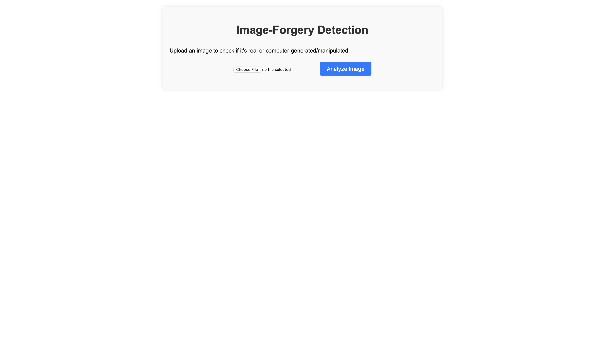
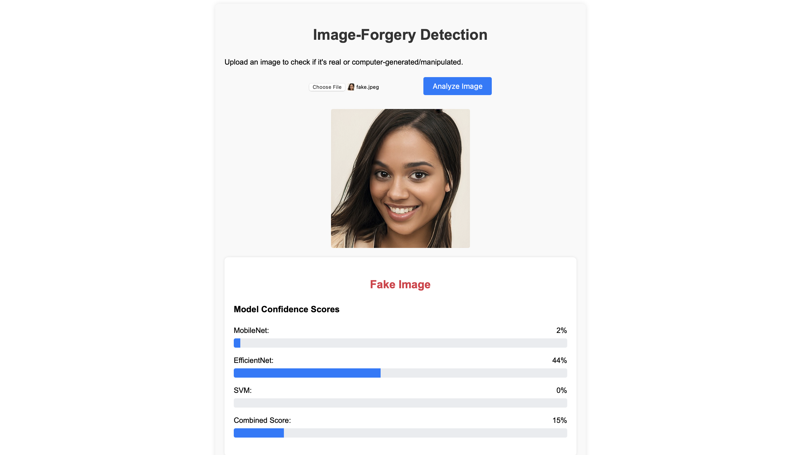

# Image Spoof Detection System

A multi-stage image spoof detection pipeline integrating deep learning and traditional machine learning models, served via a Flask web application.

---

## Table of Contents

- [Project Overview](#project-overview)  
- [Features](#features)  
- [System Architecture](#system-architecture)  
- [Datasets](#datasets)  
- [Methodology](#methodology)  
  - [Module 1: Data Acquisition & Preprocessing](#module-1-data-acquisition--preprocessing)  
  - [Module 2: 2D Image Forgery Detection](#module-2-2d-image-forgery-detection)  
  - [Module 3: Deepfake Detection](#module-3-deepfake-detection)  
  - [Module 4: 3D Mask Spoofing Detection](#module-4-3d-mask-spoofing-detection)  
- [Results](#results)  
- [Quick Start](#quick-start)  
- [Team Contributions](#team-contributions)  
- [License](#license)  
- [Acknowledgements](#acknowledgements)  

---

## Project Overview

This project, completed for the DA‑221M course (Jan 2025–Apr 2025), implements a robust, multi-stage image spoof detection system. By combining the strengths of CNN-based forgery detectors (MobileNetV2, EfficientNetB0) with micro-texture analysis (SVM on LBP features), the pipeline can identify 2D forged images, deepfakes, and 3D mask attacks in real time via a user-friendly Flask web interface.

---

## Features

- **Multi-Stage Detection Pipeline**  
  - 2D image forgery detection  
  - Deepfake detection  
  - 3D mask spoofing detection  

- **Hybrid ML/DL Approach**  
  - MobileNetV2 & EfficientNetB0 for global features  
  - SVM on Local Binary Pattern (LBP) for micro-texture analysis  

- **Interactive Web Interface**  
  - Upload an image and receive per-module confidence scores plus an overall authenticity score  

---

## System Architecture

Each uploaded image is preprocessed and then passed through three modules in sequence. Each module outputs a confidence score (real vs. fake), and the final decision is the average of the three (threshold = 0.5).

| Module                        | Model(s)                       | Input Size | Key Technique                      |
|-------------------------------|--------------------------------|------------|------------------------------------|
| 2D Image Forgery Detection    | MobileNetV2 (fine-tuned)       | 224 × 224  | CNN + dropout, batch‑norm, GAP     |
| Deepfake Detection            | EfficientNetB0 (fine-tuned)<br>+ Dlib head‑pose features | 256 × 256  | CNN + facial landmarks & pose      |
| 3D Mask Spoofing Detection    | SVM (RBF) on LBP features      | varies     | Log‑TV denoising + LBP histogram   |

---

## Datasets

- **CASIA-FASD**  
  Large crowd‑collected face anti‑spoofing dataset with print, replay, and mask attacks (used in Module 2).

- **140k Real and Fake Faces**  
  70k real images (Flickr) + 70k StyleGAN‑generated fakes (used in Module 3).

- **Labeled Faces in the Wild (LFW)**  
  Real face images + synthetic mask presentations (used in Module 4).

---

## Methodology

### Module 1: Data Acquisition & Preprocessing

- **Web App Backend (Flask)**  
- **LTV Denoising** for micro‑texture clarity  
- **Deep Models**: resize to 224 × 224, normalize to [0,1]  
- **LBP Pipeline**: grayscale → Log‑TV denoise → uniform LBP (radius=3, points=24) → histogram → SVM

---

### Module 2: 2D Image Forgery Detection

- **Dataset**: CASIA‑FASD  
- **Model**: MobileNetV2 (ImageNet pre‑trained)  
  - Global average pooling, batch normalization, dropout, sigmoid output  
  - Fine‑tune deeper layers, freeze early layers  
- **Augmentation**: rotation, flip, scale  
- **Performance**:  
  - **Accuracy**: 97.90%  
  - **Precision**: 99.69%  
  - **Recall**: 95.86%  
  - **F1 Score**: 97.73%  

---

### Module 3: Deepfake Detection

- **Dataset**: 140k Real & Fake Faces  
- **Model**: EfficientNetB0 (fine‑tuned) + Dlib landmarks & head‑pose estimation  
  - Extract pose vectors; focus on facial dynamics inconsistencies  
  - Add dense layers, batch‑norm, LeakyReLU, dropout  
  - Freeze half of base layers → train 2 epochs with Adam  
- **Performance**:  
  - **Accuracy**: 98.23%  
  - **Precision**: 98.62%  
  - **Recall**: 97.83%  
  - **F1 Score**: 98.22%  

---

### Module 4: 3D Mask Spoofing Detection

- **Dataset**: LFW + mask‑wearing video frames  
- **Preprocessing**: grayscale → Log‑TV denoise → LBP (radius=3, points=24)  
- **Model**: SVM (RBF) on normalized LBP histograms  
- **Performance**:  
  - **Accuracy**: 95.63%  
  - **Precision**: 96.00%  
  - **Recall**: 96.00%  
  - **F1 Score**: 96.00%  

---

## Results

  
*Figure 1: Application home page (image upload & model selection).*

  
*Figure 2: Results page showing per‑module scores and combined verdict.*

---

## System Architecture & Performance
The system is built from three distinct detection modules. Each was trained and evaluated independently before being integrated.

| Detection Module       | Key Models Used        | F1-Score |
| ---------------------- | ---------------------- | :------: |
| **2D Image Forgery**   | MobileNetV2            | 97.73%   |
| **Deepfake Detection** | EfficientNetB0, Dlib   | 98.22%   |
| **3D Mask Spoofing**   | SVM on LBP features    | 96.00%   |

*This was a team project. My primary contribution was the development of the **3D Mask Spoofing** module.*

---

## Tech Stack
-   **Machine Learning:** TensorFlow, Keras, Scikit-learn
-   **Computer Vision:** OpenCV, Dlib, Scikit-image
-   **Core Libraries:** Python, NumPy

---

## Quick Start

1.  **Clone the Repository:**
    ```bash
    git clone https://github.com/[your-username]/image-spoof-detection-system.git
    cd image-spoof-detection-system
    ```

2.  **Install Dependencies:**
    *(It is recommended to use a virtual environment)*
    ```bash
    pip install -r requirements.txt
    ```

3.  **Run the Flask Application:**
    ```bash
    # Ensure your trained model files (.h5, .pkl) are in the correct directory
    flask run
    ```
---

## Team Contributions
-   **Module 1 (Web App & Preprocessing):** Bipan Chandra
-   **Module 2 (2D Forgery):** Pratik Ranjan
-   **Module 3 (Deepfake):** Rithvik Ponnapalli
-   **Module 4 (3D Mask Spoofing):** Rehan Sherawat

